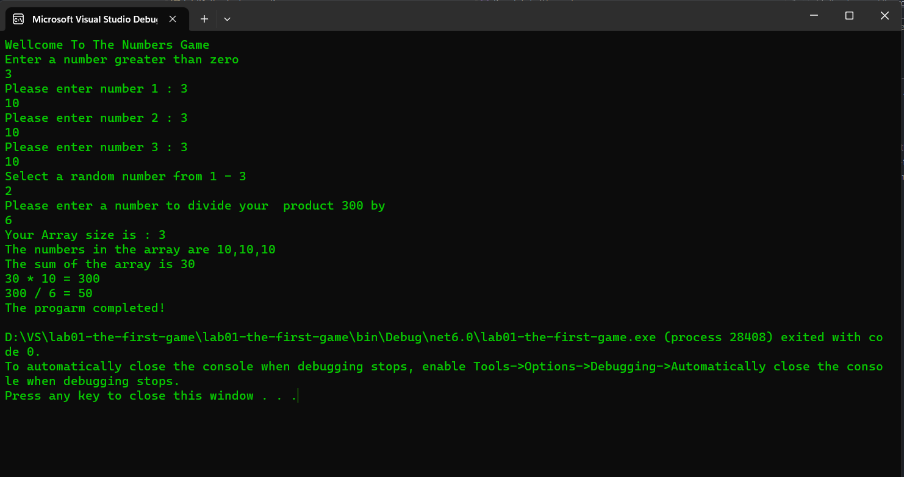

# lab01-the-first-game

### For setting up this program you have to:

1. Create a new C# project in Visual Studio Community:

- Open Visual Studio Community.
- Click on "Create a new project."
- Select "Console App (.NET Core)" as the project template.
- Choose a name and location for your project, and click "Create."

2. Replace the existing code:

- In the newly created project, replace the existing code in the "Program.cs" file with the provided code.

3. Build and run the program:

- Save the changes to the code file.
- Press Ctrl + Shift + B (or go to Build -> Build Solution) to build the project.
- Press Ctrl + F5 (or go to Debug -> Start Without Debugging) to run the program.

4. Interact with the program:

- The program will prompt you to enter a number greater than zero.
- Follow the instructions and enter the required input when prompted.
- The program will perform calculations based on your input and display the results.

---
### What is the purpose of the program?
The purpose of the program is to demonstrate various programming concepts in C# by implementing a number game. The program asks the user to input a number greater than zero, populates an array with the user's input, calculates the sum and product of the array elements, and performs division on the product.

---
### How do I run the program? 
To run the program, you need a C# development environment installed (such as Visual Studio Community). After setting up the project and replacing the existing code with the provided code, you can build and run the program using the IDE. The specific steps for running the program are outlined in the readme instructions provided earlier.

---

